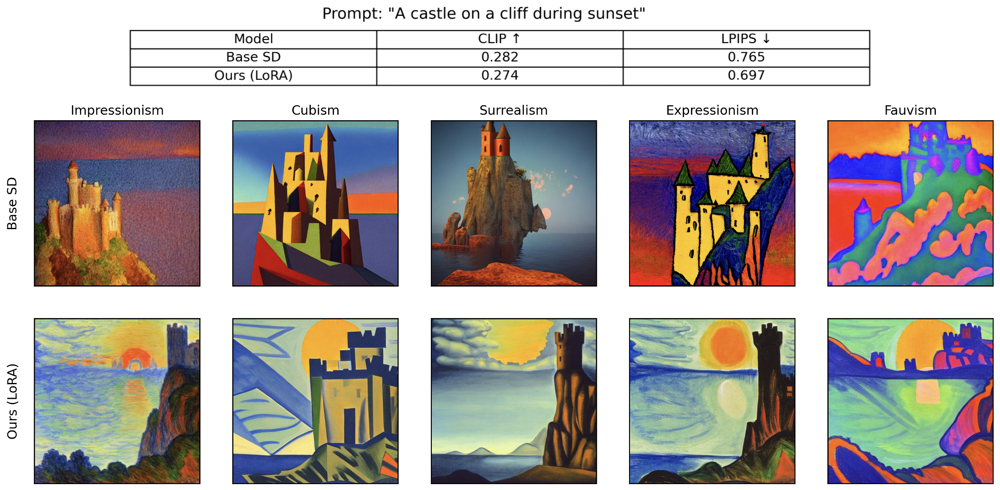

# Style-Aware Image Generation with LoRA

### 📝 Project Overview

**Style-Aware Image Generation with LoRA** explores lightweight fine-tuning of text-to-image models to better reflect artistic styles during image generation. Specifically, we fine-tune the text encoder of **Stable Diffusion v1.5** using **LoRA (Low-Rank Adaptation)** to better condition on artistic style prompts like _“in the style of Impressionism”_ or _“Cubism”_.

The training is conducted on a curated subset of the **WikiArt dataset**, where each image is paired with a style-specific caption (e.g., _“A castle on a cliff during sunset, in the style of Surrealism”_). Only the text encoder is adapted using LoRA, allowing fast and efficient fine-tuning with reduced compute.

We evaluate performance using **CLIPScore**, and **LPIPS** across several artistic styles and visualize the outputs in a comparative grid. The model shows improved alignment to style prompts without degrading generation quality.

## 📊 Benchmark Results

[//]: # (| Model         | FID ↓   | CLIP ↑  | LPIPS ↓ |)

[//]: # (|---------------|---------|---------|---------|)

[//]: # (| Base SD       | XX.XX   | 0.XXX   | 0.XXX   |)

[//]: # (| Ours &#40;LoRA&#41;   | XX.XX   | 0.XXX   | 0.XXX   |)

<div align="center">
  
</div>


## 📁 Project Structure

```
.
├── config.yaml                     
├── evaluate.py                    
├── train.py                      
├── utils.py                      
├── README.md                     
├── requirements.txt              
├── assets/                       
│   └── benchmark_combined_table_grid.png
└── .gitignore                    
```

[//]: # ()
[//]: # (## ⚙️ Setup)

[//]: # ()
[//]: # (Install dependencies:)

[//]: # ()
[//]: # (```bash)

[//]: # (pip install -r requirements.txt)

[//]: # (```)

[//]: # ()
[//]: # (Set up your LoRA fine-tuned model and base model paths in `config.yaml`.)

[//]: # ()
[//]: # (## 🧪 Evaluation)

[//]: # ()
[//]: # (Run the benchmark:)

[//]: # ()
[//]: # (```bash)

[//]: # (python evaluate.py)

[//]: # (```)

[//]: # ()
[//]: # (Generated comparison grids and metrics will be saved to your configured logging directory.)

## 🧠 Credits

- [CompVis/stable-diffusion](https://github.com/CompVis/stable-diffusion) — for the original Stable Diffusion model
- [HuggingFace PEFT](https://github.com/huggingface/peft) — for LoRA-based fine-tuning
- [Diffusers](https://github.com/huggingface/diffusers) — for model pipeline and inference
- [TorchMetrics](https://github.com/Lightning-AI/torchmetrics) — for FID and LPIPS computation
- [Transformers](https://github.com/huggingface/transformers) — for CLIP model and text-image evaluation
- [WikiArt dataset](https://www.wikiart.org/) — as the training and evaluation data source

## 📜 License

CreativeML Open RAIL-M License
